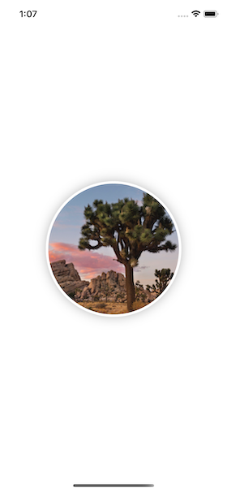
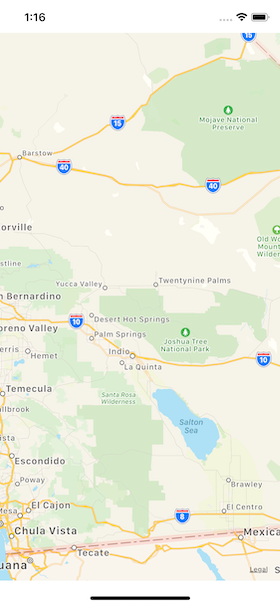
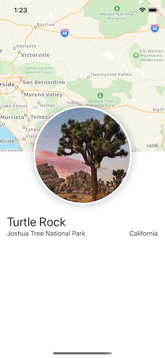
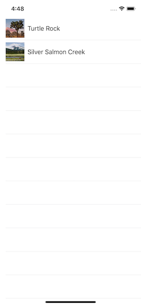
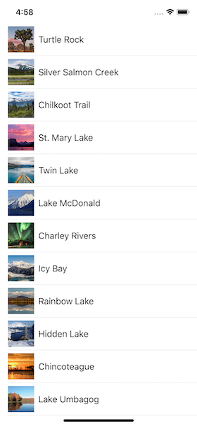
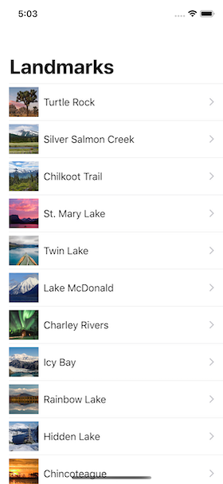
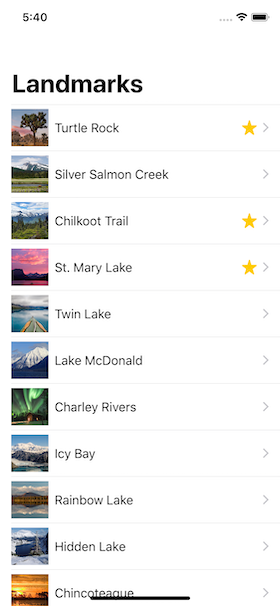
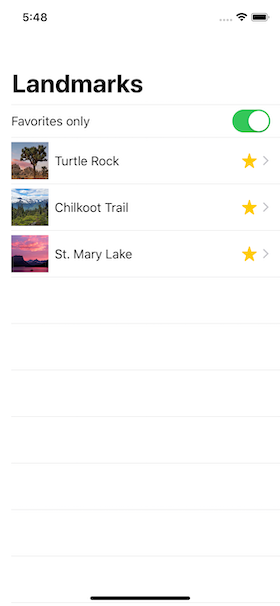
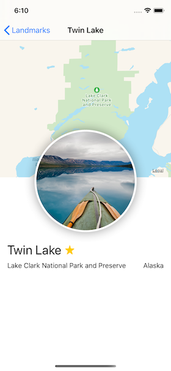

# Landmarks

Landmarks is project part of the SwiftUI Tutorials, created by Apple to showcase their brand new SwiftUI, that is a modern way to declare user interfaces for any Apple platform. 

You can find the complete tutorial, following each stage of the project through the tags in this releases section.

#### Official SwiftUI Tutorial: 
- [Landmark Tutorial](https://developer.apple.com/tutorials/swiftui)

## Creating and Combining Views

**Section 1:** Create a New Project and Explore the Canvas *(0.0.1)* 
**Section 2:** Customize the Text View *(0.0.2)* 
**Section 3:** Combine Views Using Stacks *(0.0.3)* 
**Section 4:** Create a Custom Image View *(0.0.4)* 
**Section 5:** Use UIKit and SwiftUI Views Together *(0.0.5)* 
**Section 6:** Compose the Detail View *(0.0.6)* 

## Building Lists and Navigation

**Section 1:** Get to Know the Sample Data *(0.1.0)* 
**Section 2:** Create the Row View *(0.1.1)* 
**Section 3:** Customize the Row Preview *(0.1.2)* 
**Section 4:** Create the List of Landmarks *(0.1.3)* 
**Section 5:** Make the List Dynamic *(0.1.4)* 
**Section 6:** Set Up Navigation Between List and Detail *(0.1.5)* 
**Section 7:** Pass Data into Child Views *(0.1.6)* 
**Section 8:** Generating Previews Dynamically *(0.1.7)* 

## Handling User Input

**Section 1:** Mark the User’s Favorite Landmarks *(0.2.0)* 
**Section 2:** Filter the List View *(0.2.1)* 
**Section 3:** Add a Control to Toggle the State *(0.2.2)* 
**Section 4:** Use a Bindable Object for Storage *(0.2.3)* 
**Section 5:** Adopt the Model Object in Your Views *(0.2.4)* 
**Section 6:** Create a Favorite Button for Each Landmark *(0.2.5)* 

